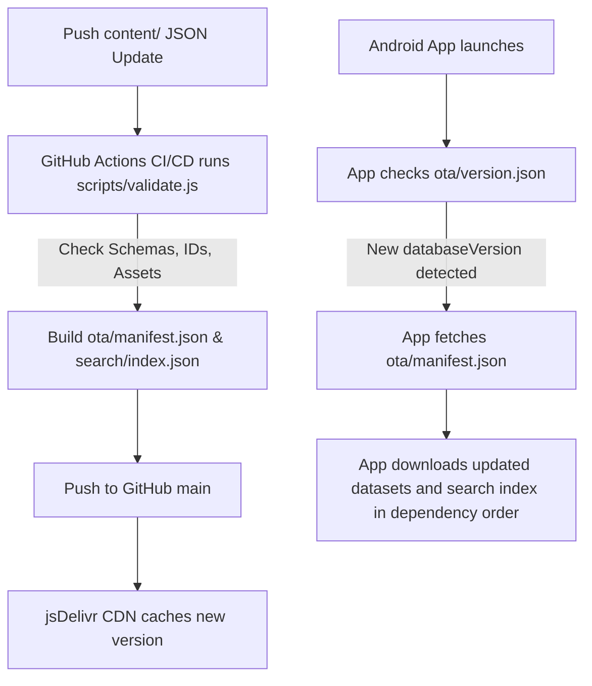

# ViceBase CDN

The Content Delivery Network (CDN) repository for the ViceBase Android Companion Application.

This repository serves as the single source of truth for all dynamic GTA 6 content, metadata, media catalogs, and OTA updates. It contains **no Android source code** and is strictly designed to host content datasets, schemas, media specs, and automated validation tools.

---

## 📂 Repository Structure

```text
vicebase-cdn/
├── .github/workflows/   # CI/CD validation actions
├── ai/                  # Future AI prompts, embeddings, and metadata models (reserved)
├── content/             # Raw JSON data partitioned by category
│   ├── characters/
│   ├── locations/
│   ├── news/
│   ├── timeline/
│   ├── vehicles/
│   └── weapons/
├── docs/                # Comprehensive implementation and update guides
├── media/               # Structured media placeholder folders and asset mappings
├── ota/                 # Published update versions and manifest registries
├── registry/            # Master dataset definitions and dependency graph
├── schemas/             # JSON schemas for each dataset type
├── scripts/             # Manifest builders, check-sum generators, and validation tools
└── search/              # Pre-compiled static search index for high-speed local lookups
```

---

## 📡 OTA Update Workflow



1. **Verify & Write**: Editors modify JSON files in the `content/` folder.
2. **Validate & Build**: The `scripts/validate.js` script validates entries, calculates SHA-256 hashes, regenerates `search/index.json`, and updates `ota/manifest.json` and `ota/version.json`.
3. **Commit & Deploy**: Committing changes pushes content to GitHub, making it instantly available globally via jsDelivr.

---

## 🔗 jsDelivr Integration

Static content is served directly using the jsDelivr GitHub CDN.

- **Characters Dataset**: `https://cdn.jsdelivr.net/gh/linkdaddy0-dev/vicebase-cdn@main/content/characters/characters.json`
- **Latest Manifest**: `https://cdn.jsdelivr.net/gh/linkdaddy0-dev/vicebase-cdn@main/ota/manifest.json`
- **Version File**: `https://cdn.jsdelivr.net/gh/linkdaddy0-dev/vicebase-cdn@main/ota/version.json`
- **Search Index**: `https://cdn.jsdelivr.net/gh/linkdaddy0-dev/vicebase-cdn@main/search/index.json`

---

## ⚠️ Important Legal Rules

This repository **DOES NOT** and **MUST NOT** store copyrighted assets owned by Rockstar Games or Take-Two Interactive (e.g., screenshots, trailers, official branding files, textures, gameplay videos).
- Use **only** original layouts, graphics, vectors, logos, and placeholders generated for ViceBase.
- For official trailers or screenshots, refer only to external resources (such as YouTube video IDs or official Rockstar URL links).

---

## 🛠️ Contribution & Development

To setup and validate content locally:

```bash
# Clone the repository
git clone https://github.com/linkdaddy0-dev/vicebase-cdn.git
cd vicebase-cdn

# Install dependencies (if any) and run validation pipeline
node scripts/validate.js
```

Detailed guides are located in the `docs/` folder:
- See [JSON Guide](docs/JSON_GUIDE.md) for data schemas and format definitions.
- See [Media Guide](docs/MEDIA_GUIDE.md) for media resolution and sizing targets.
